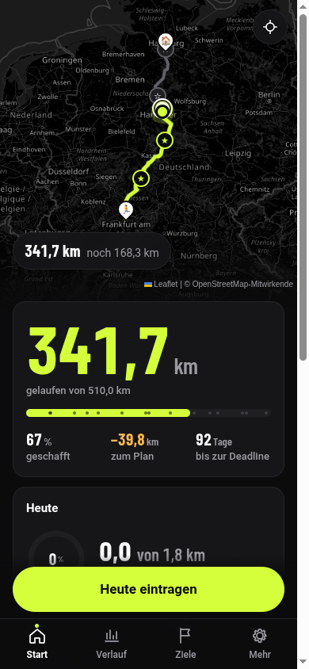
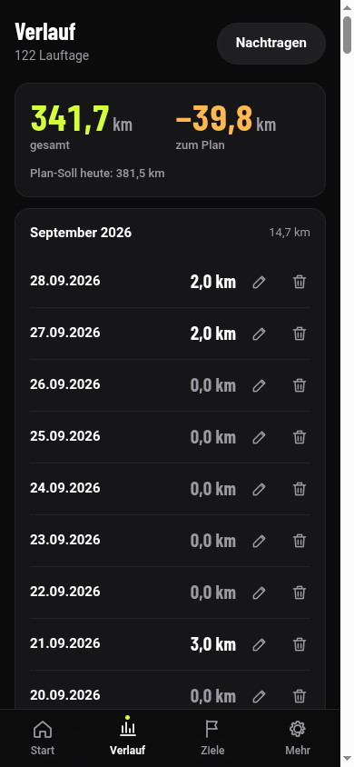
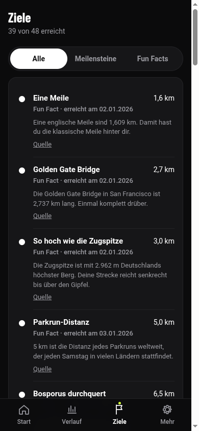
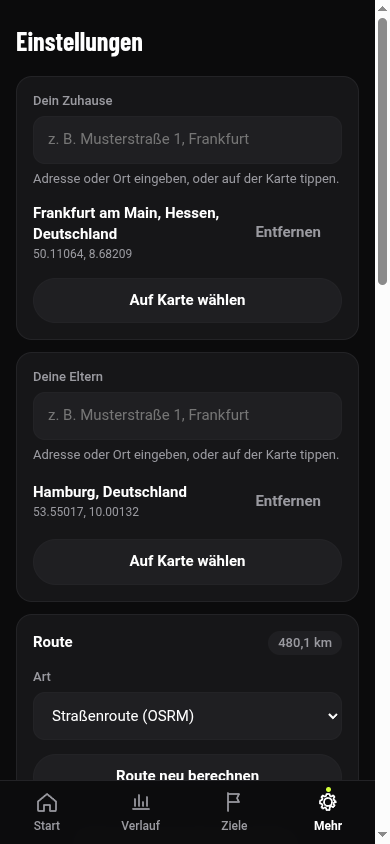

# Run Home

Persönlicher Lauf-Tracker: jeden Tag Kilometer eintragen und auf der Karte sehen, wie weit du auf der Strecke zu deinen Eltern schon bist. Mit Meilensteinen, Fun Facts (mit Quellen), Wochenziel, Erinnerungen und Over-the-Air-Updates.

Aktuelles Release: [neuestes Release](https://github.com/gitbydbcconsulting/run-home-releases/releases/latest) (`run-home.apk`, `dist.zip`, `latest.json`)

## Screenshots

| Start | Verlauf |
| --- | --- |
|  |  |

| Ziele | Einstellungen |
| --- | --- |
|  |  |

Vorher/Nachher-Vergleich der Design-Politur: [docs/screenshots/README.md](docs/screenshots/README.md). Die Karte nutzt OpenStreetMap-Kacheln, die per CSS-Filter abgedunkelt werden.

## Am Windows-PC testen (WSL)

```bash
cd ~/workspace/runapp-matthias
npm install
npm run dev
```
Dann im Windows-Browser `http://localhost:5173` öffnen, F12 → Geräte-Modus (z. B. Pixel 7). Erinnerungen und OTA sind im Browser Stubs; die Einstellungen zeigen eine Web-Vorschau.

Tests: `npm test` · Typen: `npm run typecheck` · Seed aus der Excel neu erzeugen: `npm run seed`

Screenshots neu erzeugen (Dev-Server muss laufen, Playwright und Chromium müssen installiert sein):
```bash
npm install -D playwright@1.63.0 && ./node_modules/.bin/playwright install chromium
OUT_DIR=docs/screenshots node scripts/screenshots.mjs
```
`OUT_DIR` ist optional (Standard `docs/screenshots`), `BASE_URL` ebenfalls (Standard `http://localhost:5173`).

## Android-APK

Jeder Tag `vX.Y.Z` löst den GitHub-Actions-Workflow „Release" aus. Ergebnis im Release: `run-home.apk` (auf dem Handy installieren, „Unbekannte Quellen" erlauben), `dist.zip` (OTA-Bundle), `latest.json`.

Der Workflow nutzt das auf dem Runner vorinstallierte Android SDK und JDK 21 (Temurin); fehlende SDK-Pakete werden per `sdkmanager` nachgeladen.

Release erzeugen: `scripts/release.sh 1.0.1 "Was sich geändert hat"`

### Signatur einrichten (einmalig)
1. GitHub → Actions → „Keystore erzeugen (einmalig)" → Run workflow mit einem Passwort.
2. Artifact `keystore` laden, Inhalt von `keystore.b64` als Secret `ANDROID_KEYSTORE_BASE64` anlegen.
3. Secrets `ANDROID_KEYSTORE_PASSWORD` (dein Passwort), `ANDROID_KEY_ALIAS` = `runhome`, `ANDROID_KEY_PASSWORD` (dein Passwort).
Ohne Secrets baut der Workflow eine Debug-APK; die lässt sich nicht über eine signierte Release-APK installieren (vorher deinstallieren).

## Over-the-Air-Updates
Die App lädt beim Start `latest.json` aus dem neuesten Release des öffentlichen Repos `run-home-releases`. Ist die Version neuer als die laufende, wird `dist.zip` geladen und beim nächsten Wechsel in den Hintergrund aktiviert. Reine Web-Änderungen brauchen keine neue APK. Nach nativen Änderungen (neues Capacitor-Plugin, Manifest) `minNativeVersion` im Workflow anheben und die APK neu installieren.

### Öffentliches Release-Repo
Die Build-Artefakte (`run-home.apk`, `dist.zip`, `latest.json`) liegen öffentlich in [`gitbydbcconsulting/run-home-releases`](https://github.com/gitbydbcconsulting/run-home-releases); der Quellcode bleibt im privaten Repo `run-home`. Der Release-Workflow lädt sie dort mit dem Secret `RELEASES_TOKEN` hoch (ohne Secret wird der Schritt mit einer Warnung übersprungen). Empfohlen ist ein fein-granularer Token mit Contents: read/write nur für `run-home-releases`.

## Daten
Alles liegt lokal auf dem Gerät. Einstellungen → Daten: Export als JSON (komplett) oder CSV, Import mit Vorschau (Zusammenführen/Ersetzen). Die Excel „Laufliste 2026" ist als Seed eingebaut (`src/data/seed-2026.json`).

## Fun Facts
`src/data/funfacts.de.json`: `km`, `title`, `text`, `source`. Neue Fakten nur mit Quelle ergänzen; `npm test` prüft Sortierung und Pflichtfelder.
