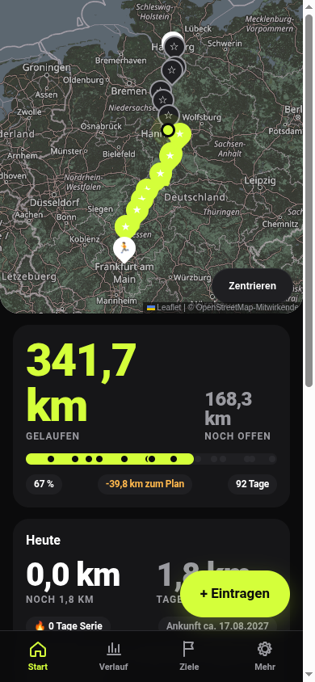
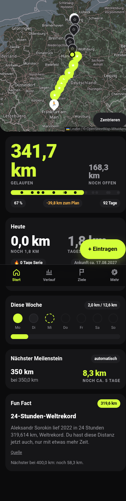
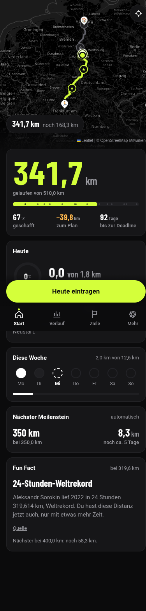
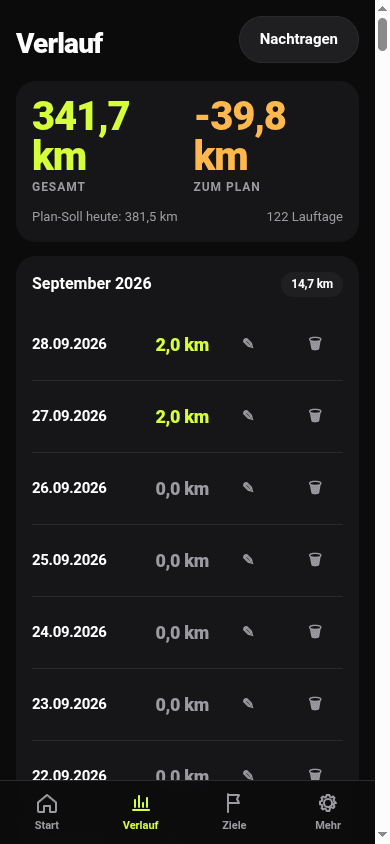
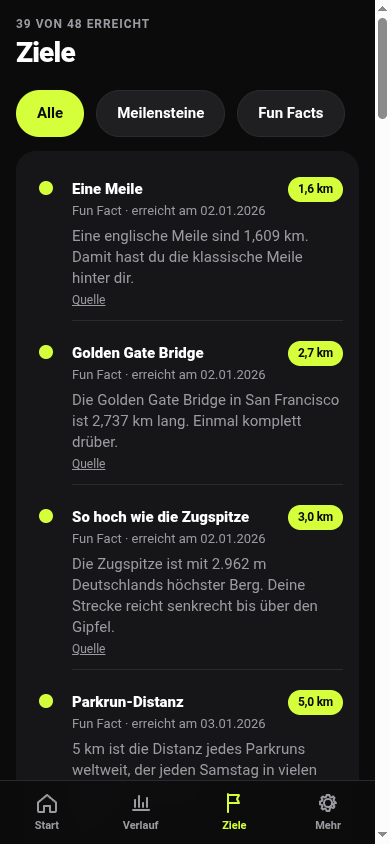
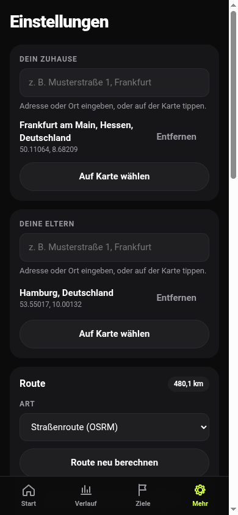
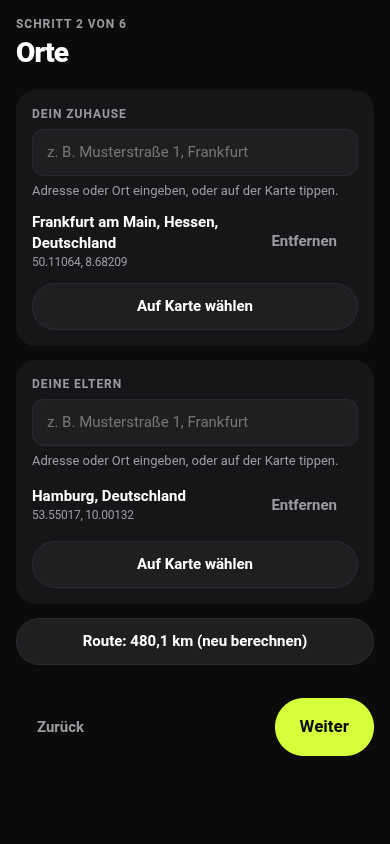
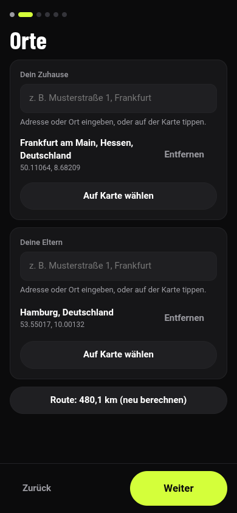

# Screenshots: Design-Politur (Task 22)

Aufgenommen mit Playwright bei 390 × 844 px, Route Frankfurt am Main → Hamburg, Laufliste 2026 geladen.

| Screen | Vorher | Nachher |
| --- | --- | --- |
| Start (Viewport) |  |  |
| Start (ganze Seite) |  |  |
| Verlauf |  |  |
| Ziele |  |  |
| Einstellungen |  |  |
| Setup, Schritt 2 |  |  |

Hinweis: Bei den Ganzseiten-Aufnahmen rendert Playwright die fest positionierten Elemente (Eintragen-Balken, Tab-Leiste) an der Stelle des ersten Viewports mitten im Bild. Auf dem Gerät bleiben sie unten fixiert.

Wichtigste Änderungen:

- Die Karte ist Hero mit Verlauf in den Inhalt, einem Zusammenfassungs-Chip und nur noch Start, Ziel, Position, eigenen Meilensteinen, 25/50/75/100 % und dem nächsten Meilenstein.
- „Heute eintragen" ist ein fester Balken über der Tab-Leiste statt eines schwebenden Buttons, der Inhalte überdeckte.
- Zahlen und Titel in Barlow Condensed, Labels in Satzschreibweise, Volt nur noch für Hauptzahl, gelaufene Strecke, primären Button und aktiven Tab.
